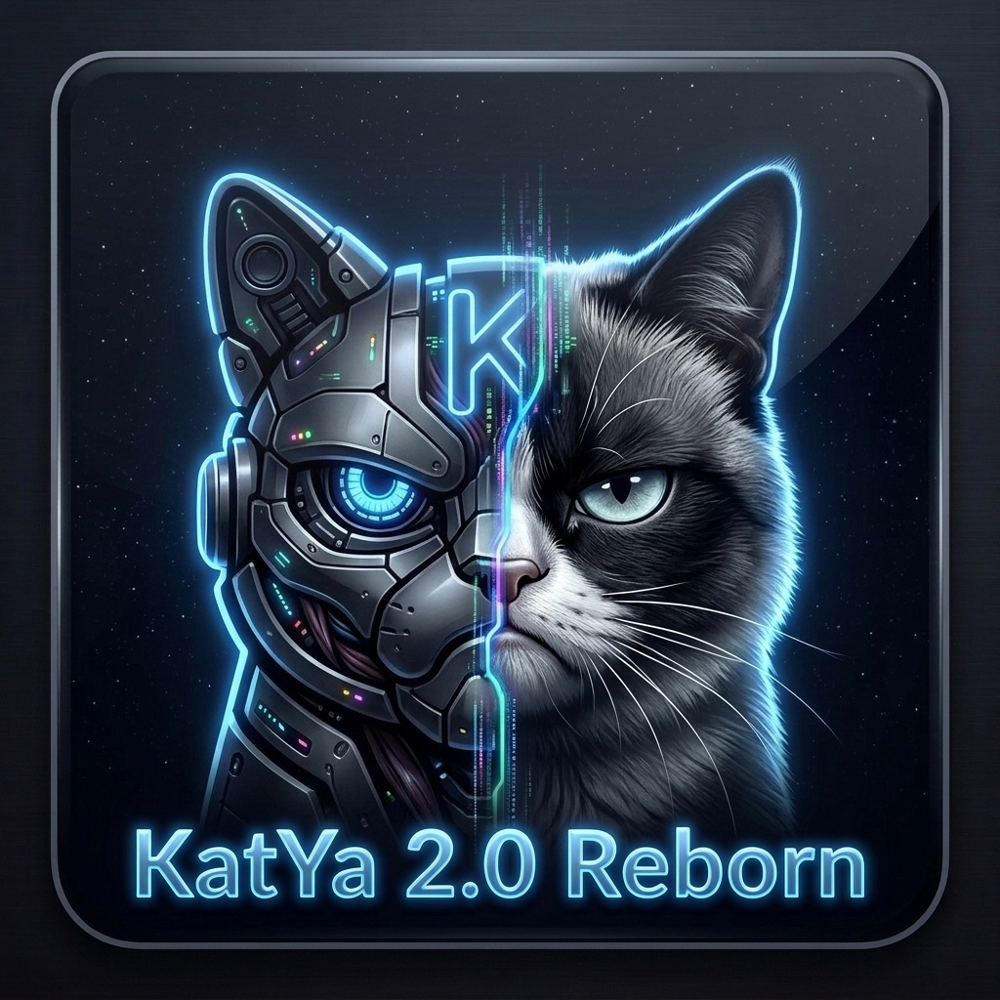

# Katya AI Assistant

**[English](#english) | [Русский](#русский)**

---

<a name="english"></a>
## 🇬🇧 English


<div align="center">
<br>

<br>
<br>

An **open-source AI assistant with persistent memory** designed specifically for Android devices.

*Note: The server backend infrastructure for Katya is deployed via the [SmartBotHelper](https://github.com/SokolovAnV/KatYa) repository.*

</div>

### 🆕 What's New in v2.4.15
- **Interactive Onboarding:** A new interactive permissions checklist with a voice greeting on the very first launch.
- **Operating Modes:** Easily switch between God Mode (root + full system control), Sandbox (isolated), and Bare Android (no external tools) to match your security and usage needs.
- **Manual Memory & Tasks:** New interfaces to directly add memories and schedule background tasks (Cron/Time/Heartbeat) without relying entirely on AI autonomy.
- **Dynamic Capabilities:** Katya is now fully aware of her environment and can tap into external Hermes skills or verify Agent-Reach network access dynamically.
- **Autonomous Brain (Auto-Heal):** If your remote Ollama server goes down, Katya wakes up locally via `LiteRT` and autonomously connects via SSH to try and restart the service, or searches for a free API proxy.

### ✨ Key Features

[📖 Read the full list of Katya's capabilities here](docs/capabilities_en.md)

- **Offline Wake Word**: Detects "Привет Катя" locally using Vosk speech recognition without an internet connection.
- **Direct Ollama Connection**: Tunnels traffic through SSH directly to your private server, completely bypassing cloud API limits.
- **Server Monitoring**: Real-time SSH monitoring overlay that displays CPU, RAM, and GPU usage of your connected Linux server.
- **Persistent Memory**: Automatically remembers important facts, details, and preferences across conversations.
- **Interactive UI**: The AI can generate fully interactive screens (dashboards, recipes, brainstorms) instead of just plain text.

### 📥 Downloads

| Platform | Format | Download |
|----------|--------|----------|
| Android | APK | [GitHub Releases](https://github.com/Gegaremant/KatYa_2/releases) |

### 🧠 Architecture

```text
               ┌─────────────────────────┐
               │          Chat           │
               │                         │
               │  prompt + memories      │
               │        │                │
               │        ▼                │
               │    ┌────────┐           │
               │    │   AI   │◀─┐        │
               │    └───┬────┘  │        │
               │        │   tool calls   │
               │        │   & results    │
               │        ▼      │        │
               │    ┌────────┐ │        │
               │    │ Tools  │─┘        │
               │    └───┬────┘          │
               │        │               │
               └────────┼───────────────┘
                        │ store / recall
                        ▼
               ┌─────────────────┐    hitCount >= 5
               │     Memory      │───────────────────┐
               │                 │                   │
               │  facts, prefs,  │                   ▼
               │  learnings      │          ┌────────────────┐
               │                 │◀─delete──│ Promote into   │
               └─────────────────┘          │ System Prompt  │
                        ▲                   └────────────────┘
                        │ reviews
                        │
               ┌─────────────────┐
               │    Heartbeat    │
               │                 │
               │  autonomous     │
               │  self-check     │
               │  every 30 min   │
               │  (8am–10pm)     │
               │                 │
               │  all good?      │
               │  → stays silent │
               │  needs action?  │
               │  → notifies user│
               └─────────────────┘
```

---

<a name="русский"></a>
## 🇷🇺 Русский


<div align="center">
<br>

<br>
<br>

**Голосовой ассистент с искусственным интеллектом и постоянной памятью**, разработанный специально для Android-устройств.

*Примечание: Инфраструктура сервера для Кати разворачивается через репозиторий [SmartBotHelper](https://github.com/SokolovAnV/KatYa).*

</div>

### 🆕 Что нового в версии 2.4.15
- **Интерактивный Onboarding:** Красивый стартовый экран с чек-листом необходимых разрешений и голосовым приветствием от Кати при первом запуске.
- **Режимы работы:** Возможность переключения между God Mode (Root + полный контроль), Sandbox (изоляция) и Bare Android (без внешних утилит) под разные уровни безопасности.
- **Ручное управление:** Новые экраны для прямого добавления записей в Память и постановки Задач (Cron/Time/Heartbeat) без необходимости просить об этом ассистента.
- **Динамические навыки:** Системный промпт теперь динамически подстраивается под окружение, предоставляя Кате знания о доступных навыках (Hermes skills) и состоянии сети (Agent-Reach).
- **Автономный Мозг (Auto-Heal):** Если ваш внешний Ollama сервер падает, Катя просыпается на локальном движке `LiteRT` и пытается автономно зайти по SSH, чтобы перезапустить сервис, либо находит бесплатные API-прокси для ответа.

### ✨ Ключевые возможности

[📖 Полный список возможностей Кати читайте здесь](docs/capabilities_ru.md)

- **Офлайн активация голосом**: Локальное распознавание фразы "Привет Катя" с помощью движка Vosk, без необходимости интернета.
- **Прямое подключение к Ollama**: Работа через встроенный SSH туннель напрямую к вашему приватному серверу (никаких лимитов облачных API и платных подписок).
- **Мониторинг сервера**: Оверлей в реальном времени с отображением загрузки CPU, RAM и GPU с вашего Linux-сервера по SSH.
- **Постоянная память**: Катя автоматически запоминает важные факты и ваши предпочтения из всех предыдущих диалогов.
- **Интерактивный UI (Карточки)**: ИИ может генерировать не только скучный текст, но и интерактивные экраны-виджеты.

### 📥 Скачать

| Платформа | Формат | Ссылка |
|----------|--------|----------|
| Android | APK | [GitHub Releases](https://github.com/Gegaremant/KatYa_2/releases) |

### 🧠 Архитектура

```text
               ┌─────────────────────────┐
               │           Чат           │
               │                         │
               │  запрос + воспоминания  │
               │        │                │
               │        ▼                │
               │    ┌────────┐           │
               │    │   ИИ   │◀─┐        │
               │    └───┬────┘  │        │
               │        │вызовы функций  │
               │        │и результаты    │
               │        ▼      │        │
               │    ┌────────┐ │        │
               │    │Инструм.│─┘        │
               │    └───┬────┘          │
               │        │               │
               └────────┼───────────────┘
                        │ запись/чтение
                        ▼
               ┌─────────────────┐    hitCount >= 5
               │     Память      │───────────────────┐
               │                 │                   │
               │ факты, вкусы,   │                   ▼
               │ знания          │          ┌────────────────┐
               │                 │◀─удал.───│ Перенос в      │
               └─────────────────┘          │ Системный Промпт│
                        ▲                   └────────────────┘
                        │ проверки
                        │
               ┌─────────────────┐
               │   Сердцебиение  │
               │   (Heartbeat)   │
               │                 │
               │ авто-проверка   │
               │ каждые 30 мин   │
               │ (с 8:00 до 22:00)│
               │                 │
               │ всё хорошо?     │
               │ → молчит        │
               │ нужны действия? │
               │ → пишет юзеру   │
               └─────────────────┘
```
