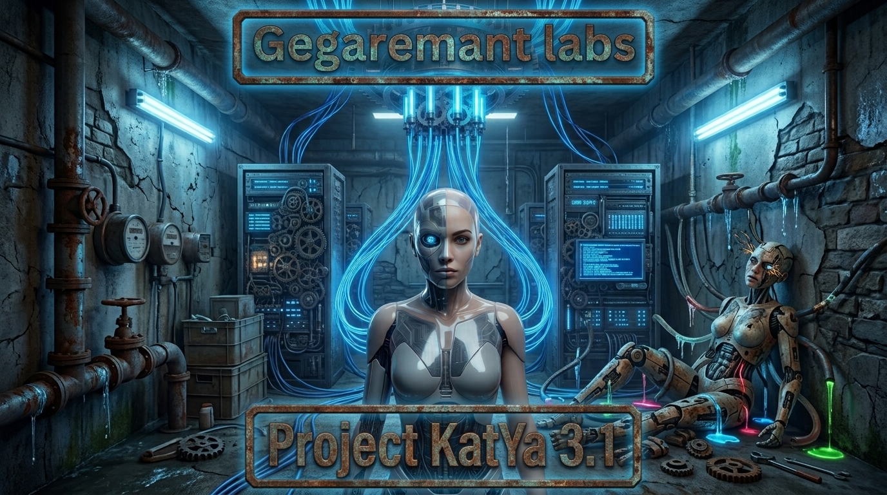

# Katya AI Assistant

<div align="center">
<br>

<br>
<br>

# [📥 Скачать последнюю версию / Download latest version 📥](https://github.com/Gegaremant/KatYa_2/releases/latest)

[](#-русский) | [](#-english)

</div>

---

# 🇷🇺 Русский

## 📖 Описание проекта (Для чего это нужно?)

**KatYa** — это продвинутый и полностью автономный AI-ассистент для Android-устройств. Проект создан для тех, кто хочет иметь мощный искусственный интеллект прямо в своем кармане с максимальной приватностью. 
В отличие от обычных ботов, Катя обладает собственной памятью, может работать в фоне и умеет управлять операционной системой Android. Благодаря встроенной песочнице (PRoot) и возможности получения Root-прав, это не просто чат, а полноценный инструмент для автоматизации, выполнения команд и локального запуска нейросетей.

## 🌟 Возможности Кати

- **Абсолютная автономность**: Работает в фоновом режиме, самостоятельно выполняет запланированные задачи и проводит регулярный самоанализ (Heartbeat).
- **Персистентная память**: Автоматически запоминает важные факты о вас и контекст прошлых бесед, развиваясь вместе с пользователем.
- **Два режима доступа**:
  - **God Mode (Root)**: Полный контроль над Android. Катя может выполнять любые shell-команды напрямую от имени суперпользователя.
  - **Sandbox (PRoot)**: Встроенная изолированная Linux-среда. Позволяет запускать Node.js, Python, локальные серверы и утилиты прямо на телефоном без вреда для ОС.
- **Приватность и Локальная работа**:
  - Распознавание голоса (STT) работает локально через Vosk без интернета.
  - Синтез речи (TTS) работает локально через Piper.
  - Поддержка запуска локальных LLM моделей через LiteRT прямо на устройстве (формат GGUF).
- **Обход блокировок**: Встроенная поддержка VLESS / Xray для подключения к облачным моделям (OpenAI, DeepSeek и др.) через защищенные прокси, работающая нативно и без ограничений.

## 📂 Структура проекта и Описание папок

Проект построен с использованием Kotlin Multiplatform и Jetpack Compose, что обеспечивает современную архитектуру.

```text
KatYa/
├── androidApp/          # Точка входа для Android приложения, платформенно-специфичный код (манифест, JNI, запуск).
├── composeApp/          # Основная логика приложения и UI на базе Compose Multiplatform.
│   └── src/
│       ├── androidMain/ # Android-специфичные реализации интерфейсов (Root-доступ, сервисы, WebView).
│       └── commonMain/  # Общая бизнес-логика, UI экраны (Settings, Chat), работа с БД, интеграции API и работа с локальными LLM.
├── gradle/              # Конфигурация сборки Gradle и версии библиотек (libs.versions.toml).
├── RELEASE_NOTES.md     # История релизов и списки изменений (Changelogs).
└── .github/             # CI/CD: release.yml (сборка APK + публикация релиза по тегу v*), test.yml (проверки).
```

## 📱 Как пользоваться (пошаговая инструкция)

1. **Установка**
   - Скачайте последний APK со страницы [Releases](https://github.com/Gegaremant/KatYa_2/releases/latest).
   - На телефоне разрешите установку из неизвестных источников и установите APK.

2. **Первый запуск**
   - Дайте запрашиваемые разрешения по одному: уведомления, микрофон, доступ к файлам *(для God Mode)*. Катя поздоровается голосом и проверит устройство.
   - Если есть Root (Magisk/KernelSU) — активируется **God Mode** (полный доступ к системе). Без Root Катя работает через встроенную песочницу.

3. **Настройка агента и голоса**
   - Вкладка **Агент**: включите «Озвучка» — без неё голосовые функции агента заблокированы (приложение само подсветит и предложит перейти на нужную вкладку).
   - Выберите режим голоса: «По умолчанию», «Локальный» (Vosk для распознавания, Piper для синтеза — работают офлайн) или «Cloud API».

4. **Песочница (нужна для автономной работы и VLESS)**
   - Вкладка **Сервер** → **Sandbox** → «Скачать песочницу». Приложение само скачает и распакует:
     - **Debian rootfs** (образ Linux для proot);
     - **нативные библиотеки** (proot, xray) для вашей ABI — URL по умолчанию ведут на релиз v3.1.1 репозитория.
   - Ход загрузки виден в уведомлении и на вкладке «Сервер» → «Альтернативные ссылки». Любую ссылку можно заменить вручную (кнопка «Сохранить»), если загрузка не удалась с дефолтной.

5. **Подключение моделей**
   - Вкладка **Сервер**: выберите провайдера (OpenAI / DeepSeek / любая OpenAI-совместимая) и введите ключи. DeepSeek можно войти по e-mail+паролю через встроенный WebView-диалог.
   - **VLESS / Xray**: включите тумблер и добавьте прокси. Прокси используется, только когда туннель реально поднялся; если туннель недоступен — запросы автоматически идут по стандартному каналу (не зависают).
   - **Локальные модели**: на вкладке модели выберите GGUF (через поиск HuggingFace) и запускайте целиком на устройстве через LiteRT.

6. **Память и автономность**
   - Катя сама запоминает важные факты (Персистентная память) и выполняет запланированные задачи (Расписание / Пульс / Однократно) в фоне.

7. **Отладка**
   - Если что-то не работает — проверьте логи: вкладка **Сервер** → **Отладка** или спец. экран логов. Там видно состояние туннеля, sandbox и сетевых запросов.

## 🚀 Сборка локально

1. Склонируйте репозиторий:
   ```bash
   git clone https://github.com/Gegaremant/KatYa_2.git
   cd KatYa_2/KatYa
   ```
2. Откройте проект в **Android Studio** (или Fleet) и дождитесь загрузки Gradle-зависимостей.
3. Соберите проект через терминал:
   ```bash
   # Для сборки отладочной версии:
   ./gradlew assembleDebug

   # Для сборки релизной версии:
   ./gradlew assembleRelease
   ```
4. Установите получившийся APK на устройство. Для использования `God Mode` убедитесь, что на устройстве установлены Root-права (Magisk/KernelSU). Если прав нет, используйте `Sandbox`.

---

# 🇬🇧 English

## 📖 Project Description (Why is this needed?)

**KatYa** is an advanced and fully autonomous AI assistant for Android devices. This project is built for those who want a powerful artificial intelligence right in their pocket with maximum privacy.
Unlike standard chatbots, Katya has her own persistent memory, can operate in the background, and can control the Android operating system. Thanks to a built-in PRoot sandbox and optional Root access, this is not just a chat interface, but a full-fledged tool for automation, shell command execution, and running local neural networks.

## 🌟 Katya's Features

- **Absolute Autonomy**: Operates in the background, autonomously executes scheduled tasks, and performs regular self-reflection (Heartbeat).
- **Persistent Memory**: Automatically remembers important facts about you and past conversation contexts, growing alongside the user.
- **Two Access Modes**:
  - **God Mode (Root)**: Full control over Android. Katya can execute shell commands directly as a superuser.
  - **Sandbox (PRoot)**: Built-in isolated Linux environment. Allows you to run Node.js, Python, local servers, and utilities directly on the phone without harming the OS.
- **Privacy and Local Execution**:
  - Voice recognition (STT) works locally offline via Vosk.
  - Text-to-speech (TTS) works locally offline via Piper.
  - Support for running local LLM models via LiteRT directly on the device (GGUF format).
- **Censorship Bypass**: Built-in VLESS / Xray support for connecting to cloud models (OpenAI, DeepSeek, etc.) via secure proxies, running natively and unrestrictedly.

## 📂 Project Structure and Folders

The project is built using Kotlin Multiplatform and Jetpack Compose, providing a modern architecture.

```text
KatYa/
├── androidApp/          # Android entry point, platform-specific code (Manifest, JNI, launch logic).
├── composeApp/          # Main application logic and UI based on Compose Multiplatform.
│   └── src/
│       ├── androidMain/ # Android-specific implementations (Root access, Background Services, WebView).
│       └── commonMain/  # Shared business logic, UI screens (Settings, Chat), DB operations, API integrations, and local LLM logic.
├── gradle/              # Gradle build configurations and library versions (libs.versions.toml).
├── RELEASE_NOTES.md     # Release history and changelogs.
└── .github/             # CI: release.yml (build APK + publish release on v* tags), test.yml (checks).
```

## 📱 How to Use (Step-by-Step Guide)

1. **Installation**
   - Download the latest APK from the [Releases](https://github.com/Gegaremant/KatYa_2/releases/latest) page.
   - Allow installation from unknown sources and install the APK on your phone.

2. **First Launch**
   - Grant the requested permissions one by one: notifications, microphone, file access *(for God Mode)*. Katya greets you by voice and checks the device.
   - With Root (Magisk/KernelSU) you get **God Mode** (full system access). Without Root, Katya works through the built-in Proot sandbox.

3. **Agent & Voice Setup**
   - **Agent** tab: enable "Voice" (Озвучка) — voice features stay locked without it (the app highlights this and offers a shortcut to the Agent tab).
   - Choose a voice mode: "Default", "Local" (Vosk for offline STT, Piper for offline TTS) or "Cloud API".

4. **Sandbox (required for autonomous work and VLESS)**
   - **Servers** tab → **Sandbox** → "Download sandbox". The app downloads and unpacks automatically:
     - **Debian rootfs** (Linux image for proot);
     - **native binaries** (proot, xray) for your ABI — default URLs point to the v3.1.1 release of this repository.
   - Progress is shown in a notification and on **Servers** → **Alternative links**. Any link can be replaced manually (Save button) if the default one fails.

5. **Model Connection**
   - **Servers** tab: pick a provider (OpenAI / DeepSeek / any OpenAI-compatible) and enter your keys. DeepSeek also supports e-mail + password login via a built-in WebView dialog.
   - **VLESS / Xray**: enable the toggle and add a proxy. The proxy is used only while the tunnel is actually connected; otherwise requests automatically fall back to the standard channel (no hangs).
   - **Local models**: on the models tab pick a GGUF file (HuggingFace search) and run everything on-device via LiteRT.

6. **Memory & Autonomy**
   - Katya remembers important facts (persistent memory) and runs scheduled tasks in the background (Schedule / Heartbeat / Once).

7. **Debugging**
   - If something breaks, check logs on the **Servers** tab → **Debug** or the dedicated log screen: tunnel state, sandbox state, and network requests are all visible there.

## 🚀 Local Build Instructions

1. Clone the repository:
   ```bash
   git clone https://github.com/Gegaremant/KatYa_2.git
   cd KatYa_2/KatYa
   ```
2. Open the project in **Android Studio** (or Fleet) and wait for the Gradle dependencies to sync.
3. Build the project via terminal:
   ```bash
   # Build the debug version:
   ./gradlew assembleDebug

   # Build the release version:
   ./gradlew assembleRelease
   ```
4. Install the resulting APK on your device. To use `God Mode`, make sure your device has Root access (Magisk/KernelSU). If you don't have Root, you can still use the `Sandbox` mode.